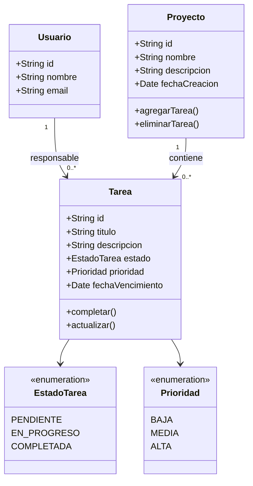

# Diagrama de clases

El modelo conceptual de TaskFlow está compuesto principalmente por las clases `Usuario`, `Proyecto` y `Tarea`.

## Relaciones

Un usuario puede ser responsable de varias tareas.

Un proyecto puede contener ninguna o varias tareas.

Cada tarea pertenece obligatoriamente a un único proyecto.

El estado y la prioridad de una tarea se representan mediante enumeraciones para limitar los valores posibles.

---
